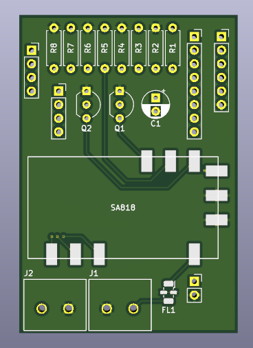
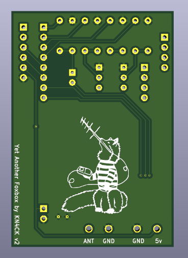

# Yet Another Foxbox (YAFB)
YAFB is an amateur radio fox transmitter designed for an ESP32-S2-Saola-1 and a NiceRF SA818.

Still being worked on and is not in a functional state but there is a cool logo to look at!

I started this because I was too cheap to buy one and I had way too much time on my hands. And I kind of am enjoying it. Weird. 

My goal is to provide a way to make a cheap alternative fox transmitter. When done you'll be provided with all the files needed to make your own, hopefully in kit form.

## Features
* 1W VHF or UHF transmitter (NiceRF SA818)
* Configure it over WiFi

## PCB

