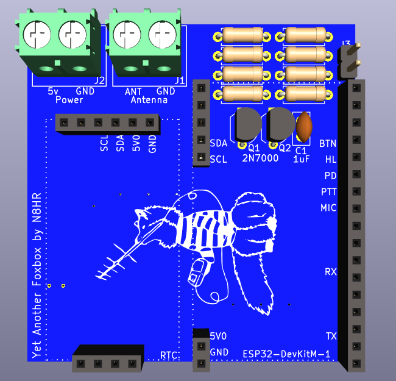
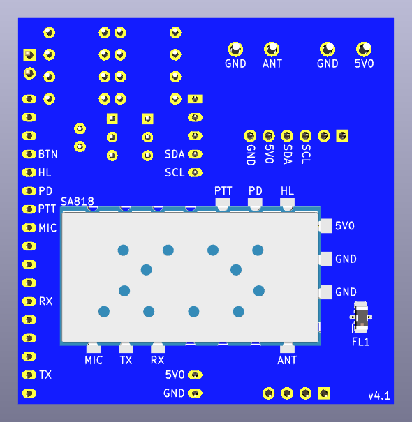

# Yet Another Foxbox (YAFB)

YAFB is an amateur radio fox transmitter designed for an ESP32-S2-Saola-1 and a NiceRF SA818.

Still being worked on and now works fairly well on my bench. Hasn't been tested yet in the field.
As of Nov 2023 just sent in to have v4.1 of the board to be made. More updates soon.

I started this because I was too cheap to buy one and I had way too much time on my hands. And I kind of am enjoying it. Weird. 

My goal is to provide a way to make a cheap alternative fox transmitter. When done you'll be provided with all the files needed to make your own.

## Features
* 1W VHF or UHF transmitter (NiceRF SA818)
* Configure it over Bluetooth

## PCB
|Front|Back|
|:-:|:-:|
|||

## Parts
* 1x ESP32-S2-Saola-1R Dev Board (Microcontroller)
* 1x NiceRF SA818(S) (Transmitter)
* 1x DS3231 RTC Module (Real Time Clock)
* 1x Mini-Circuits LFCN-160+ (Low Pass Filter)
* 3x 10k Resistors
* 1x 3.3k Resistor
* 1x 1.8k Resistor
* 1x 1k Resistor
* 2x 150 Resistor
* 1x 1uF Capacitor
* 2x 2N7000 Transistor
* 2x TB002-500-02BE Terminal Blocks
* Male and Female Header Connectors
* 5v Power Source
* Optional Push Button

## Licenses
* The hardware side of this project uses the CERN Open Hardware Licence Version 2 - Weakly Reciprocal (CERN-OHL-W-2.0)
* The software side of this project uses the GNU General Public License v3.0 or later (GPL-3.0-or-later)
